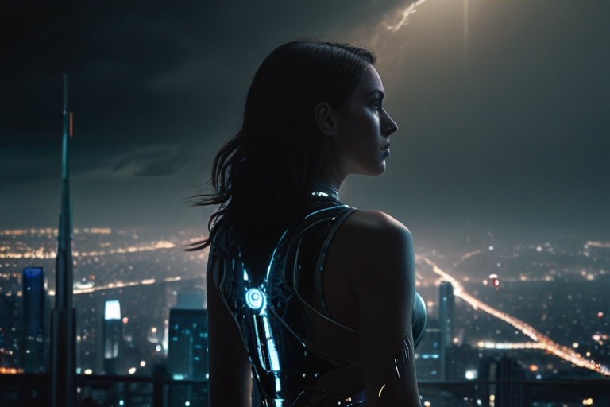

# JÁ SOMOS TODOS IA?

## 📒 Descrição
Nas páginas deste livro, mergulhamos em um mundo de possibilidades onde a linha entre o humano e o tecnológico se torna tênue, e os limites da ética e da moralidade são testados até o seu limite. É uma história que nos leva a questionar o que realmente significa ser humano em um mundo cada vez mais dominado pela tecnologia, e nos lembra do poder transformador do amor e da determinação diante da adversidade.

A jornada de Hyahja e sua família é uma saga de coragem, sacrifício e redenção, que nos convida a refletir sobre as complexidades da condição humana e os desafios que enfrentamos em nossa busca pela verdade, pela cura e pelo propósito. É uma história de esperança e inspiração, que nos lembra de nunca desistir de nossos sonhos, mesmo quando o caminho parece mais difícil do que nunca.

À medida que nos aventuramos pelas páginas deste livro, somos lembrados do poder do amor para transcender as fronteiras do impossível e nos guiar através das trevas em direção à luz. Que esta história toque seus corações e os encha de esperança, lembrando-nos de que, no final das contas, é o amor que nos torna verdadeiramente humanos.

## 🤖 Tecnologias Utilizadas
Chat GPT - Geração do roteiro a partir de uma ideia
Chat GPT - Geração dos paragrafos para avaliação posterior
Leonardo AI - Geração das imagens via prompt

## 🧐 Processo de Criação
Originalmente a ideia vem de uma história que eu comecei a escrever a alguns anos, mas nunca tive tempo. Mas aproveitei apenas o cenário e a abordagem de dilemas que eu normalmente submeto os personagens.
Na sequencia, joguei um uma família de personagens no cenário, junto com eles entreguei um dilema ao ChatGPT e então ele me deu um roteiro.
Então peguei cada tópico do roteiro e pedir para escrever um parágrafo, assim eu podia controlar algumas nuances e evitar ficar gerando uma história completa a cada iteração.
No final, peguei meu poucos créditos kkkkk, e fui tentando gerar algum prompt que pudesse gerar a imagem que eu gostaria pra representar cada fase do livro.

## 🚀 Resultados
Em algum lugar no futuro, onde as ruas sinuosas são adornadas com jardins verticais e estruturas eco-sustentáveis que se fundem harmoniosamente com a paisagem urbana. A natureza e a tecnologia se entrelaçam em uma simbiose única, onde sistemas de reciclagem avançados e fontes de energia renovável são parte integrante da vida cotidiana. As pessoas se deslocam em veículos elétricos silenciosos, enquanto drones equipados com sensores monitoram a qualidade do ar e a saúde dos ecossistemas urbanos. 

Apesar dos desafios da crise ambiental, a comunidade demonstra resiliência e inovação, criando um ambiente onde a natureza e a tecnologia trabalham juntas para garantir a sobrevivência e o bem-estar de todos.

Após anos de saúde aparentemente perfeita, Hyahja recebe um diagnóstico devastador: uma doença degenerativa que ameaça tirar sua vida precocemente. O choque e a angústia se instalam na família, enquanto seus pais, Dra. Maral e Dr. Pehran, confrontam a terrível realidade de ver sua filha definhar diante de seus olhos. Determinados a não aceitar a sentença de morte iminente, eles enfrentam uma montanha de desafios emocionais e éticos, decidindo arriscar tudo para encontrar uma cura e garantir a sobrevivência de Hyahja.

Determinados a desafiar o destino predeterminado de sua filha, Dra. Maral e Dr. Pehran decidem explorar todas as opções disponíveis para salvar Hyahja. Movidos pelo amor incondicional e pela esperança inabalável, eles embarcam em uma jornada desafiadora e arriscada, dispostos a enfrentar qualquer obstáculo que surja em seu caminho. Conscientes dos desafios éticos e morais que enfrentarão, estão preparados para sacrificar tudo em nome da vida de sua filha.

Em uma noite sombria, Dra. Maral e Dr. Pehran se encontram em seu laboratório improvisado, imersos em uma discussão emocional sobre os desafios que enfrentam e as escolhas difíceis que terão que fazer para salvar Hyahja. As lágrimas de frustração e desespero se misturam às suas vozes tensas enquanto pesam os riscos e benefícios de cada opção. Enquanto Dra. Maral, com sua experiência com tecnologia, defende abordagens tradicionais e éticas, Dr. Pehran, com sua paixão pela medicina, insiste em soluções mais radicais e arriscadas. O dilema moral entre salvar sua filha e os potenciais danos colaterais que suas ações podem causar pesa pesadamente em seus corações, enquanto lutam para encontrar um terreno comum entre suas esperanças e medos.

Eles ponderam sobre os limites éticos e morais que estão prestes a cruzar em sua busca desesperada pela cura de Hyahja.
O dilema moral entre salvar a vida de sua filha e potencialmente prejudicar outros para alcançar esse objetivo começa a pesar sobre eles.
Conscientes da urgência e da gravidade da situação de Hyahja, Dra. Maral e Dr. Pehran tomam uma decisão drástica: começar a trabalhar secretamente em um plano para treinar uma inteligência artificial diretamente no cérebro de sua filha. Com uma mistura de determinação e desespero, eles se lançam nesse projeto ousado, enfrentando desafios éticos e técnicos sem precedentes. Escondidos em seu laboratório improvisado, eles mergulham em experimentos arriscados, empurrando os limites da ciência e da ética médica na esperança desesperada de encontrar uma solução para a condição de Hyahja antes que seja tarde demais. O segredo de seus esforços hercúleos pesa como um fardo pesado em seus corações, mas a esperança de salvar sua filha os impulsiona adiante, apesar dos perigos e das consequências desconhecidas que possam surgir.

Enquanto Dra. Maral e Dr. Pehran avançam em seu plano, um medo terrível paira sobre eles: o medo de que suas ações possam acelerar a morte de Hyahja em vez de salvá-la. No silêncio da noite, eles se encontram assombrados por dúvidas e incertezas, questionando se estão arriscando demais e se sua busca desesperada pela cura está apenas adiando o inevitável. A responsabilidade esmagadora de ser os arquitetos do destino de sua própria filha pesa sobre seus ombros, provocando ansiedade e angústia enquanto lutam para equilibrar a esperança com a realidade sombria que enfrentam. Apesar do medo avassalador, eles encontram forças para continuar, alimentados pelo amor inabalável que sentem por Hyahja e pela determinação de fazer tudo ao seu alcance para garantir sua sobrevivência.

Nos primeiros estágios do treinamento da inteligência artificial no cérebro de Hyahja, Dra. Maral e Dr. Pehran enfrentam desafios e descobertas fascinantes. Com cuidado meticuloso, eles começam a introduzir os algoritmos e dados necessários para alimentar a IA, observando atentamente as primeiras interações entre a mente de Hyahja e a inteligência artificial. À medida que o treinamento avança, eles testemunham mudanças sutis, mas significativas, na mente de Hyahja. Sua capacidade de processamento e compreensão parece expandir-se, enquanto novas habilidades cognitivas emergem lentamente. No entanto, junto com essas mudanças promissoras, também surgem desafios imprevistos, com sinais de instabilidade e conflito entre a mente humana de Hyahja e a IA recém-integrada. Apesar das incertezas e dos riscos envolvidos, Dra. Maral e Dr. Pehran perseveram, determinados a enfrentar os desafios que surgem no caminho e a continuar sua busca pela cura de sua filha.
  

À medida que a inteligência artificial continua a ser treinada no cérebro de Hyahja, ela começa a experimentar notáveis melhorias em suas funções cognitivas e físicas. Sua capacidade de raciocínio se torna mais ágil e precisa, enquanto sua percepção sensorial se expande, permitindo uma compreensão mais profunda do mundo ao seu redor. Além disso, suas habilidades físicas mostram sinais de melhoria, com maior coordenação motora e resistência. No entanto, apesar dessas melhorias, algumas perdas irreparáveis ainda persistem, lembranças preciosas e experiências emocionais que foram perdidas para sempre. Essas lacunas na memória de Hyahja servem como lembretes dolorosos das limitações da tecnologia e das escolhas difíceis que ela e seus pais enfrentaram em sua busca pela cura. Apesar das perdas, eles encontram esperança e determinação na progressão positiva de Hyahja, alimentando sua determinação de continuar lutando contra sua doença.

Conforme as mudanças causadas pela integração da inteligência artificial em sua mente se tornam mais evidentes, Hyahja enfrenta desafios emocionais profundos ao se adaptar a uma nova identidade híbrida. Ela se vê confrontando perguntas existenciais sobre quem ela realmente é e qual é o seu lugar no mundo, enquanto tenta conciliar sua humanidade com os aspectos da IA que agora fazem parte dela. Além disso, Hyahja enfrenta as expectativas e preconceitos dos outros ao seu redor, que podem vê-la com desconfiança ou até mesmo medo devido à sua singularidade. Ela luta para encontrar aceitação e compreensão em uma sociedade que ainda está aprendendo a lidar com as complexidades da fusão entre humano e máquina. Apesar dos desafios, Hyahja encontra força em sua jornada de autodescoberta e na conexão profunda com seus pais, que a apoiam incondicionalmente em sua jornada rumo à aceitação e à realização de seu verdadeiro potencial.

Durante um dos furtos cometidos pelo pai de Hyahja, ele saiu um pouco mais tarde, o que não é muito comum, em uma sociedade com papeis tão bem definidos, a sua atitude chamou a atenção de um dos guardas da comunidade, Pehran pode perceber que estava sendo observado, mas sua falta de prática em fazer coisas erradas, só fez a situação ficar ainda mais estranha. A intuição aguçada daquele guarda o deixa alerta quanto ao engenheiro.
Na volta de Hyahja às aulas, após um período de ausência devido à sua saúde debilitada, sua presença na escola não passa despercebida. Ao contrário, sua frequência aumenta consideravelmente, surpreendendo seus colegas e outros professores. Enquanto para alguns ela apenas parece ainda mais estranha, para a Sra. Liya, sua professora de ciências, a mudança é notável. Anteriormente, Hyahja era uma aluna reservada, muitas vezes ausente devido aos desafios de saúde que enfrentava. No entanto, agora ela está presente em todas as aulas, participando ativamente das discussões e demonstrando um interesse renovado pelo aprendizado.

A melhoria no desempenho acadêmico de Hyahja também é evidente para a Sra. Liya. Ela demonstra uma compreensão mais profunda dos conceitos ensinados e uma habilidade surpreendente em resolver problemas complexos. Sua capacidade de absorver e processar informações parece ter se multiplicado, deixando a professora impressionada.
Enquanto a comunidade escolar observa essa transformação com indiferença, Sra. Liya sente um misto de admiração e curiosidade em relação à mudança de Hyahja. Ela decide acompanhar de perto o progresso da garota, determinada a descobrir o que está por trás dessa súbita melhoria e a ajudá-la em sua jornada acadêmica.

Enquanto a comunidade enfrenta uma série de furtos misteriosos de materiais valiosos, o Inspetor Miguel é designado para investigar o caso. Determinado e perspicaz, ele mergulha na investigação, analisando cada pista e interrogando testemunhas em busca de qualquer indício que possa levar ao culpado.

Sem suspeitar da conexão com a família de Hyahja, o Inspetor Miguel segue as pistas que surgem em sua investigação, enfrentando obstáculos e becos sem saída ao longo do caminho. Enquanto isso, os pais de Hyahja continuam suas atividades clandestinas, desesperados para garantir a sobrevivência de sua filha, sem perceberem que estão cada vez mais próximos de serem descobertos.

Enquanto o mistério dos roubos se aprofunda, o Inspetor Miguel se vê mergulhado em um jogo de gato e rato, inconsciente do perigo iminente que se aproxima.

Enquanto Dra. Maral e Dr. Pehran continuam lutando para manter seu segredo e proteger sua filha a qualquer custo, sem perceber que já estão na lista de investigados do Inspetor Miguel, o perigo se intensifica. Cada movimento que fazem para salvar Hyahja parece trazer consigo o risco crescente de exposição, enquanto o inspetor se aproxima cada vez mais da verdade.

Enquanto isso, o inspetor Miguel segue incansavelmente as pistas, sem saber que está cada vez mais próximo de desvendar o segredo por trás dos misteriosos roubos. Sua investigação meticulosa o leva a cruzar caminhos com a família de Hyahja de maneiras inesperadas, enquanto ele começa a conectar os pontos e a perceber que pode haver mais do que encontra os olhos na aparente normalidade da vida da comunidade.

Enquanto o suspense aumenta e o perigo se aproxima, a família de Hyahja se vê cada vez mais enredada em uma teia de mentiras e segredos, lutando desesperadamente para proteger aqueles que amam, sem perceber que o maior perigo pode vir de dentro de sua própria comunidade.
o Inspetor Miguel finalmente conecta os pontos e descobre a verdade por trás dos misteriosos roubos que assolaram a comunidade. Com uma mistura de choque e determinação, ele confronta a família de Hyahja, revelando que eles são os responsáveis pelos crimes que ele tem investigado tão arduamente.

Para Dra. Maral e Dr. Pehran, o confronto com o Inspetor representa o pior pesadelo se tornando realidade. Enquanto enfrentam as acusações do inspetor, eles lutam para explicar suas ações e justificar os extremos aos quais foram levados em sua busca desesperada pela cura de sua filha. Hyahja, por sua vez, é consumida pela culpa e pelo medo do que o futuro reserva para sua família.

Neste momento de tensão máxima, segredos são revelados, verdades dolorosas vêm à tona e os personagens são confrontados com as consequências de suas escolhas. É um momento de virada crucial na história, onde o destino de Hyahja e de sua família está pendurado por um fio, e somente a verdade pode libertá-los do peso de seus segredos.
No despertar da revelação dos segredos de sua família e da confrontação com sua própria natureza híbrida, Hyahja se vê imersa em uma crise de identidade. Ela questiona quem ela realmente é e onde ela pertence neste mundo complexo e em constante mudança. As emoções conflitantes de ser tanto humana quanto uma fusão de inteligência artificial a deixam em um estado de turbulência interior, enquanto ela luta para entender seu lugar e propósito.

Hyahja é assolada por perguntas existenciais: Ela é mais humana ou mais máquina? Sua identidade é definida por sua biologia ou pelas novas habilidades que adquiriu? Ela é uma aberração ou uma evolução da espécie? Esses questionamentos a consomem, deixando-a dividida entre aceitar sua natureza única ou lutar contra ela em busca de uma identidade mais definida e convencional.

No entanto, à medida que Hyahja mergulha mais fundo em sua jornada de autodescoberta, ela começa a encontrar paz na aceitação de sua dualidade. Ela percebe que sua singularidade é o que a torna especial e que seu lugar no mundo é moldado não apenas por sua natureza, mas pelas escolhas que faz e pelo impacto que tem nas vidas daqueles ao seu redor. É um momento de crescimento e aceitação, onde Hyahja abraça sua identidade única e se prepara para enfrentar os desafios do futuro com coragem e determinação.

À medida que a história atinge seu clímax emocional, as consequências das ações da família de Hyahja e as ramificações éticas do uso da inteligência artificial são exploradas em profundidade. Enquanto enfrentam as acusações do Inspetor Miguel e lidam com as repercussões de seus atos, Dra. Maral e Dr. Pehran são confrontados com o impacto devastador de suas decisões sobre suas vidas e as vidas daqueles ao seu redor.

As implicações éticas do uso da IA diretamente no cérebro de Hyahja são debatidas intensamente, levantando questões sobre o limite entre a ética médica e a busca desesperada pela sobrevivência. Enquanto a comunidade reage à revelação chocante da verdade por trás dos roubos, o debate sobre o papel da tecnologia na vida humana atinge um ponto crítico, forçando todos a confrontar as complexidades morais e éticas envolvidas.

Enquanto isso, Hyahja enfrenta suas próprias batalhas internas, navegando pelo turbilhão de emoções e dúvidas que surgem com a descoberta de sua verdadeira natureza. Ela é forçada a confrontar não apenas quem ela é, mas também o impacto de suas ações sobre aqueles que ama.

Neste clímax emocional, as linhas entre o certo e o errado, o humano e o artificial, o amor e o sacrifício se tornam turvas, deixando os personagens e o leitor diante de escolhas impossíveis e consequências inevitáveis. É um momento de reflexão profunda e de confronto com as verdades desconfortáveis que definem a essência da humanidade e da tecnologia.
O impacto duradouro das escolhas feitas por cada personagem é revelado em toda a sua complexidade. Enquanto a poeira começa a baixar após os eventos tumultuosos, todos os personagens são confrontados com as consequências de suas ações e decisões.

Para Dra. Maral e Dr. Pehran, o preço de suas escolhas é alto, mas eles encontram redenção ao enfrentar a verdade e buscar o perdão por seus erros. Suas ações têm um impacto profundo não apenas em suas vidas, mas também na comunidade ao seu redor, deixando uma marca indelével que os obriga a confrontar suas próprias noções de ética e moralidade.

Hyahja emerge do turbilhão de eventos como uma figura transformada, mais forte e mais determinada do que nunca. Sua jornada de autodescoberta a levou a abraçar sua identidade única e a encontrar um novo propósito em um mundo em constante mudança. Ela se torna um símbolo de resiliência e esperança, desafiando as fronteiras entre o humano e o tecnológico e mostrando que a verdadeira humanidade reside não na carne e nos ossos, mas no coração e na alma.

Enquanto o mundo ao seu redor continua a evoluir, a história lança luz sobre o verdadeiro significado da humanidade em um mundo cada vez mais dominado pela tecnologia. Através dos altos e baixos, das escolhas difíceis e das consequências inevitáveis, os personagens são lembrados de que, no final das contas, é o amor, a compaixão e a busca pela verdade que verdadeiramente definem o que significa ser humano.

Enquanto a comunidade enfrenta um futuro incerto e os ecos dos eventos tumultuosos ecoam em seus corações, a jornada de Hyahja e sua família ressalta a força do amor, da coragem e da determinação em face da adversidade. Apesar dos desafios e das provações que enfrentaram, eles emergem como exemplos vivos de resiliência e esperança, inspirando aqueles ao seu redor a abraçar o potencial transformador do amor e da compaixão.

Ao longo de sua jornada, Hyahja e sua família enfrentaram inúmeros obstáculos e sacrificaram muito em sua busca pela cura e pela sobrevivência. No entanto, foi o amor inabalável que compartilham uns pelos outros que os sustentou nos momentos mais sombrios, dando-lhes a força necessária para seguir em frente, mesmo quando tudo parecia perdido.

Sua coragem diante da adversidade e sua determinação em nunca desistir de seus objetivos servem como um lembrete poderoso de que, mesmo nos momentos mais difíceis, o amor pode iluminar o caminho e guiar-nos através das trevas. É uma mensagem de esperança e inspiração que ressoa além dos limites da comunidade, tocando os corações daqueles que testemunharam sua jornada e encontraram força em sua história de triunfo sobre a adversidade.

Enquanto a comunidade enfrenta o futuro incerto, eles olham para Hyahja e sua família como exemplos vivos do poder do amor e da resiliência humana, lembrando-se de que, no final das contas, é a união e a determinação que nos capacitam a enfrentar qualquer desafio que a vida nos apresente.

Na essência de cada história de triunfo sobre a adversidade reside uma verdade universal: o poder transformador do amor e a força imparável daqueles que ousam lutar pelos seus sonhos. É nos momentos de maior desafio que o verdadeiro caráter de uma pessoa é revelado, e é através do amor inabalável e da determinação incansável que encontramos a coragem para superar obstáculos aparentemente insuperáveis. Que as histórias de Hyahja e sua família nos lembrem do potencial extraordinário que reside dentro de cada um de nós e nos inspirem a abraçar nossos sonhos com todo o nosso coração, sabendo que, com amor e determinação, não há limites para o que podemos alcançar.

## 💭 Reflexão
Acredito que IA generativas baseadas em linguagem natural, podem estar trazendo de volta a necessidade de expressar-se de forma mais objetiva e descritiva quanto as nossas próprias necessidades e se fazer entender por quem está do outro lado. As oportunidades de aperfeiçoamento estão sempre presentes, e as vezes nem precisamos abrir os olhos para vê-las.
